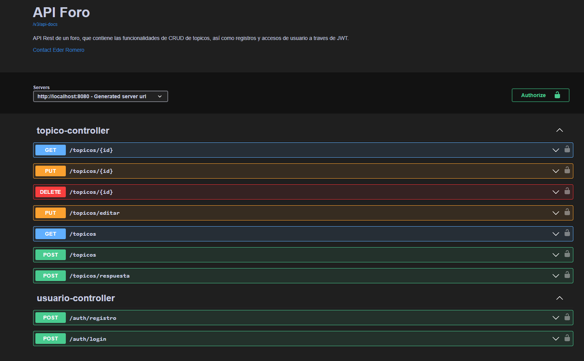

# API REST Foro - challengeoneforoalura5
Este proyecto es una API REST para un foro en línea, donde los usuarios pueden publicar temas y respuestas en diferentes categorías de discusión.

## Tecnologías Utilizadas
- **Java (versión 17): Lenguaje de programación principal utilizado en el proyecto.**
- **Spring Boot: Framework para la creación de aplicaciones basadas en Java.**
- **Spring Boot Starter Data JPA: Facilita el acceso a bases de datos relacionales usando Spring Data JPA**
- **Spring Boot Starter Web: Proporciona funcionalidades para crear aplicaciones web.**
- **Spring Boot DevTools: Herramientas para el desarrollo eficiente de aplicaciones Spring Boot.**
- **Spring Boot Starter Test: Contiene dependencias para realizar pruebas en aplicaciones Spring Boot.**
- **Spring Boot Starter Validation: Configura la validación de datos en Spring Boot.**
- **Spring Boot Starter Security: Configura la seguridad en aplicaciones Spring Boot.**
- **Flyway: Herramienta de migración de bases de datos que se integra con Spring Boot.**
- **MySQL Connector/J: Conector para la base de datos MySQL en Java.**
- **Project Lombok: Biblioteca para reducir el código boilerplate en Java.**
- **Spring Security: Marco de autenticación y autorización para aplicaciones Java.**
- **JWT (JSON Web Tokens): Estándar utilizado para la creación de tokens de acceso.**
- **SpringDoc OpenAPI: Herramienta que genera documentación de la API en formato OpenAPI.**

## Funcionalidades Destacadas

### Sistema de Login y Registro de Usuarios

El proyecto incluye un sistema de autenticación basado en JWT. Los usuarios pueden registrarse y luego iniciar sesión para acceder a las funcionalidades protegidas.

### Verificación por JWT

La autenticación en este proyecto se basa en JSON Web Tokens (JWT), un estándar abierto para tokens de acceso seguro. JWT se utiliza para la verificación de usuarios y la autorización en la aplicación.

## Configuración de la Base de Datos
La aplicación está configurada para usar MySQL como base de datos. Asegúrate de tener un servidor MySQL en ejecución. Edita el archivo application.properties con la información de tu base de datos: 
<pre>spring.datasource.url=jdbc:mysql://localhost:3306/tu_base_de_datos
spring.datasource.username=tu_usuario
spring.datasource.password=tu_contraseña</pre>

## JavaDoc
La documentación detallada del código, incluyendo explicaciones de clases y métodos, está disponible en formato JavaDoc.

- **JavaDoc: Documentación que describe en detalle las clases y métodos del proyecto**

## Acceso a la Documentación de la API
La documentación de la API, generada por SpringDoc OpenAPI, está disponible en:

- **Swagger UI: Interfaz interactiva para explorar y probar los endpoints de la API.**
- **API Docs: Documentación en formato JSON que describe la API.**
  
## Url Swagger
http://localhost:8080/swagger-ui/index.html#/

